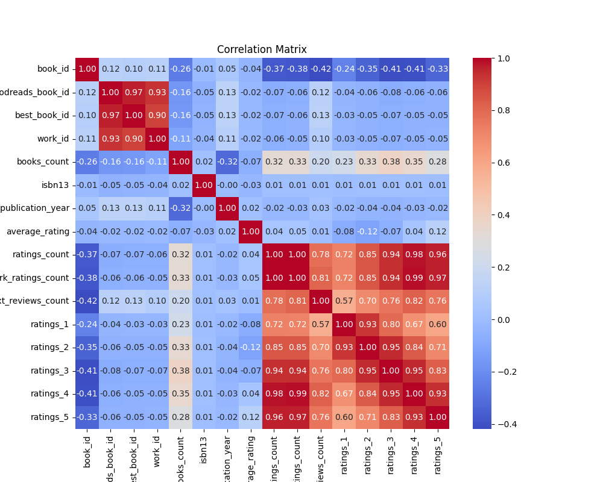

# Project: Goodreads Dataset Analysis

## Overview
This project analyzes a Goodreads dataset to uncover insights about the relationships between various book-related attributes, such as ratings, publication year, and counts of reviews. Using statistical analysis, a correlation matrix is computed and visualized as a heatmap to understand patterns and associations among the attributes.

## Analysis Objectives
- Investigate relationships between key attributes in the Goodreads dataset.
- Identify highly correlated variables to derive actionable insights.
- Provide a visual representation of correlations using a heatmap.

## Dataset Description
The analysis is based on a CSV file, `goodreads.csv`, which contains data for books with the following attributes:
- `book_id`: Unique identifier for books.
- `goodreads_book_id`: Goodreads identifier.
- `best_book_id`: Best book identifier.
- `work_id`: Work identifier.
- `books_count`: Number of editions of the book.
- `isbn13`: International Standard Book Number.
- `publication_year`: Year the book was published.
- `average_rating`: Average rating of the book.
- `ratings_count`: Total count of ratings.
- `work_ratings_count`: Ratings for the work.
- `text_reviews_count`: Count of text reviews.
- `ratings_1`, `ratings_2`, `ratings_3`, `ratings_4`, `ratings_5`: Count of 1-star, 2-star, 3-star, 4-star, and 5-star ratings respectively.

## Methodology
1. **Load the Dataset**: The dataset is read into a Pandas DataFrame for processing.
2. **Calculate Correlation Matrix**: Pearson correlation coefficients are calculated between numerical attributes.
3. **Visualize Correlations**: A heatmap is generated to visually represent the correlations.

## Key Findings
- `ratings_count` and `work_ratings_count` have a very high correlation of **0.99**, indicating these two attributes are almost interchangeable.
- `ratings_4` and `ratings_5` are highly correlated with `average_rating`, with correlations of **0.98** and **0.97**, respectively, suggesting that higher ratings significantly influence the overall average.
- The `publication_year` attribute has weak correlations with most attributes, implying that the year of publication is not a strong determinant of popularity or rating.

## Heatmap Visualization
The following heatmap visualizes the correlation matrix:

## Actionable Recommendations
- For predictive models focusing on ratings, `ratings_count`, `work_ratings_count`, and `average_rating` should be prioritized due to their strong correlations with other key variables.
- Consider grouping books based on their average ratings and high ratings (e.g., `ratings_4` and `ratings_5`) to identify popular books.
- Attributes like `publication_year` may not be significant predictors and can be excluded in specific use cases.

## Files
- `goodreads.csv`: The dataset used for analysis.
- `goodreads_heatmap.png`: Heatmap visualization of the correlation matrix.

## Tools Used
- **Python Libraries**: Pandas, NumPy, Matplotlib, Seaborn
- **Environment**: Jupyter Notebook

## How to Run
1. Clone this repository and ensure the required files are in the same directory.
2. Install the necessary Python libraries: `pip install pandas numpy matplotlib seaborn`
3. Run the Jupyter Notebook or script to regenerate the analysis and heatmap.
